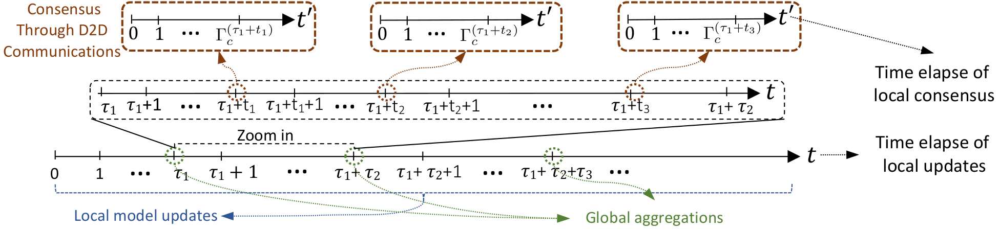

# Two Timescale Hybrid Learning (TT-HL)



- Paper on [IEEE Explore](https://ieeexplore.ieee.org/abstract/document/9562522)
- ArXiv: [Semi-Decentralized Federated Learning with Cooperative D2D Local Model Aggregations](https://arxiv.org/abs/2103.10481)
- Data: We currently do not have a permanent link to the data (including model parameters, data splits, and network graphs). However, please feel free to reach out to me and we will try to figure a way out to share the data dump with you over dropbox or google drive.

### Setup

- The two main prerequisites are:
  - pytorch==1.4.0
  - syft==0.2.9

- The python version used for experiments: 3.6.9

### Running Experiments

- Download MNIST and FMNIST.
- Update the config file `src/common/config.py` for correct locations of `data_path`.
- Generate the initial data splits, model starting points, and graphs:

```bash
cd src

# to generate data splits, fmnist and mnist must be downloaded and data_path set.
sh sh/gen_data.sh <dataset=mnist|fmnist>_<num-nodes=25|125>

# to generate initial models
sh sh/gen_init_models.sh
```

- All the experiments are run using shell scripts of the format `src/sh/train_*.sh`.
- There are two models used: fully connected nets (fcn) and support vector machines (svm).
- The corresponding shell scripts contain the substrings `fcn` or `svm`.
- Experiments are performed for two network graphs w.r.t csi and no-csi as explained in the paper. The corresponding shell scripts contain substrings `csi` or `nocsi`.

## Generating plots

- Finish training first. This generates the files in the checkpoints folder that are needed to create plots.
- Alternately reach out to us for a dump of our trained meta data files.
- All the plots can be executed using shell scripts of the format `src/sh/plot_*.sh`.

## Citation

If you find the [repository](https://github.com/shams-sam/TwoTimeScaleHybridLearning) or the [paper](https://ieeexplore.ieee.org/abstract/document/9562522) useful, please cite the following paper

```
@article{
  lin2021semi,
  title={Semi-decentralized federated learning with cooperative D2D local model aggregations},
  author={Lin, Frank Po-Chen and Hosseinalipour, Seyyedali and Azam, Sheikh Shams and Brinton, Christopher G and Michelusi, Nicolo},
  journal={IEEE Journal on Selected Areas in Communications},
  volume={39},
  number={12},
  pages={3851--3869},
  year={2021},
  publisher={IEEE}
}
```

